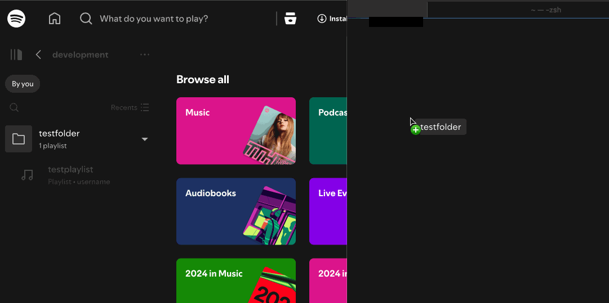

# Spotify Folder Tools

> This project aims to use Spotify's Internal Api to automate organizing playlists into folders.

Folder IDs can be retrieved by dragging+dropping one into a plain text editor or terminal

These folder IDs are the same as the "group" IDs in the private API

enter venv: `source .venv/bin/activate`
exit evenv: `deactivate`

### thoughts: make this repo JUST for the folder tools, and use a separate repo that depends on this one for folder actions. plus pip, in the future, with lots of work.
- could have a main repo that shows all of my spotify tools, with this one just being for folders
- another for different auth types
- etc
(just a thought)

#### future plan:

✅ Check for existed cached credentials - if they exist, use them

✅ ~~attempt to make simple call with prior credentials. if call fails, get new credentials~~ using timeout instead

---

> [!CAUTION]
> This project is not associated with Spotify in any manner, and may break at any time. Use at your own risk.